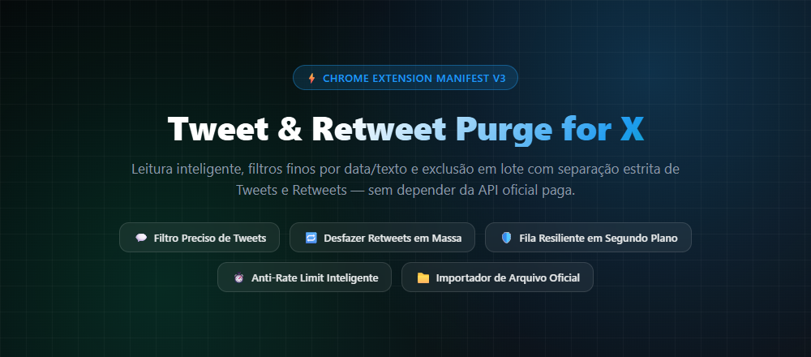
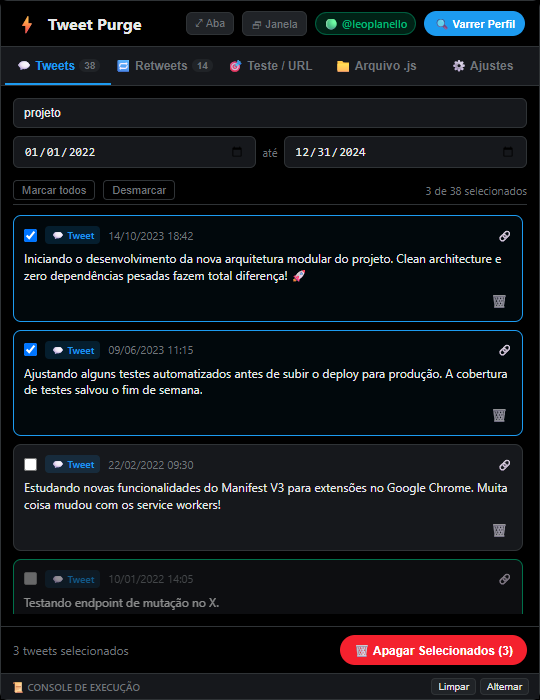
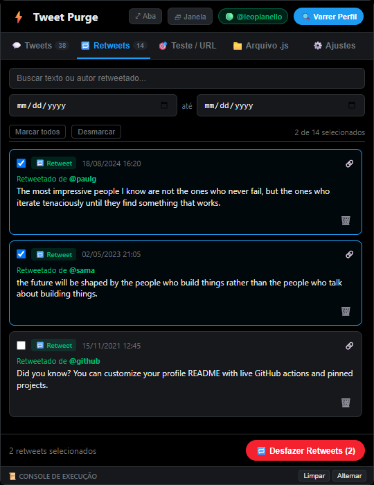
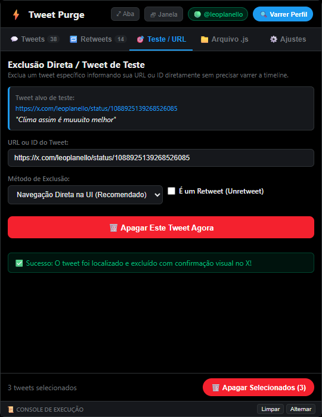
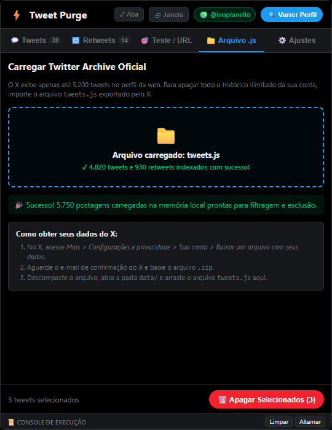
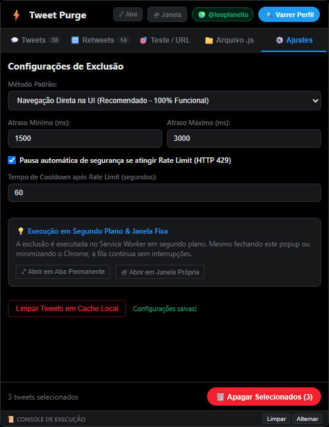
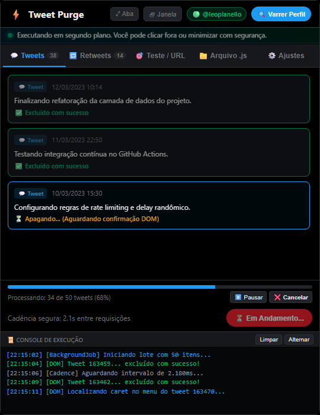

<div align="center">

  

  <br />

  <h1>⚡ Tweet & Retweet Purge for X (Twitter)</h1>

  <p>
    <strong>A ferramenta definitiva para escanear, filtrar e excluir em lote Tweets e Retweets no X (Twitter)</strong><br />
    <em>Sem necessidade de API oficial paga, com separação estrita de tipos, cadência humana anti-ban e execução resiliente em segundo plano.</em>
  </p>

  <p>
    <a href="#-instalação-passo-a-passo"></a>
    <a href="#-estrutura-e-arquitetura"></a>
    <a href="#-privacidade-e-segurança"></a>
    <a href="LICENSE"></a>
  </p>

  <p>
    <a href="#-funcionalidades-principais">Funcionalidades</a> •
    <a href="#-capturas-de-tela">Demonstração Visual</a> •
    <a href="#-instalação-passo-a-passo">Instalação</a> •
    <a href="#-guia-de-uso">Guia de Uso</a> •
    <a href="#-arquitetura">Arquitetura</a> •
    <a href="#-privacidade-e-segurança">Segurança</a>
  </p>
</div>

---

## 💡 Por que este projeto existe?

Com as alterações nas políticas do **X (Twitter)**, o acesso à API oficial passou a exigir planos pagos de custo extremamente elevado (a partir de centenas de dólares mensais) apenas para excluir postagens da sua própria conta. Além disso, as interfaces web convencionais limitam a rolagem da timeline a apenas cerca de **3.200 tweets**.

O **Tweet & Retweet Purge for X** foi desenvolvido para devolver o controle total da sua conta e da sua privacidade:
- **100% Gratuito e Ilimitado**: Opera diretamente na sessão do seu próprio navegador sem depender de chaves de API pagas.
- **Separação Rigorosa**: Diferencia com precisão tweets originais/respostas de retweets (unretweet).
- **Sem Limites de 3.200 Tweets**: Suporta o arquivo oficial de exportação de dados do X (`tweets.js` / `.json`), permitindo limpar contas com dezenas de milhares de postagens desde a criação.
- **Cadência Inteligente**: Intervalos aleatórios humanos e auto-recuo em caso de Rate Limit (HTTP 429).
- **Não Trava ao Minimizar**: Processamento no Service Worker em segundo plano com suporte a janelas independentes, abas completas e Side Panel lateral.

---

## 📸 Demonstração Visual

### 💬 1. Leitura, Busca e Seleção Fina de Tweets
Filtre por qualquer termo ou intervalo de datas (De / Até). Marque todos com um clique ou selecione posts específicos.
<div align="center">
  
</div>

<br />

### 🔁 2. Aba Dedicada para Retweets
Veja exatamente de quem foi cada retweet antes de apagá-lo. Desfaça retweets antigos sem colocar seus tweets autorais em risco.
<div align="center">
  
</div>

<br />

### 🎯 3. Teste Rápido / Exclusão Direta por URL
Deseja apagar apenas um post específico sem carregar a lista? Basta colar a URL ou ID do tweet e disparar a exclusão imediata.
<div align="center">
  
</div>

<br />

### 📁 4. Importação do Twitter Archive Oficial (`tweets.js`)
Diga adeus ao limite de 3.200 tweets da timeline. Arraste seu arquivo de backup oficial e indexe todo o histórico da conta.
<div align="center">
  
</div>

<br />

### ⚙️ 5. Controle de Cadência e Proteção Anti-Rate Limit
Ajuste os milissegundos mínimos e máximos entre cada requisição. Ative cooldown automático caso receba status HTTP 429.
<div align="center">
  
</div>

<br />

### 🛡️ 6. Execução Resiliente em Segundo Plano & Console ao Vivo
Acompanhe o lote em tempo real com barra de progresso, botões de Pausar/Cancelar e console com logs coloridos.
<div align="center">
  
</div>

---

## ✨ Funcionalidades Principais

| Recurso | Detalhes |
| :--- | :--- |
| **Dois Motores de Exclusão** | ⚡ **GraphQL/REST Interno** (requisições autenticadas diretas via sessão) e 🖱️ **Automação DOM** (emulação de cliques reais na UI do X com tolerância a mudanças de API). |
| **Modo Híbrido com Fallback** | Tenta exclusão rápida via requisição; se houver divergência de QueryID, realiza fallback transparente para navegação DOM. |
| **Separação Tweets vs. Retweets** | Abas isoladas com contadores individuais de itens carregados e selecionados. |
| **Filtros Avançados** | Busca instantânea por palavras-chave e filtro de intervalo por data (`De` e `Até`). |
| **Importador Archive (.js / .json)** | Lê diretamente o dump oficial fornecido pelo X (`tweets.js`), contornando o teto de 3.200 tweets da interface web. |
| **Execução em Segundo Plano** | Gerenciado pelo `Background Service Worker` do Manifest V3. O processo não morre ao clicar fora do popup ou minimizar o Chrome. |
| **Keep-Awake & Anti-Throttling** | Mecanismos de áudio inaudível e Screen Wake Lock para impedir que o Chrome suspenda timers em segundo plano. |
| **Modos de Visualização** | Popup padrão, botão `⤢ Aba` para abrir em tela cheia, botão `🗗 Janela` independente e compatibilidade com o **Chrome Side Panel**. |
| **Console de Execução Integrado** | Log visual com carimbos de data/hora, status HTTP e identificação de erros. |

---

## 📦 Instalação Passo a Passo

### Método Rápido (Usando a pasta `dist` já compilada)

1. Clone ou baixe este repositório no seu computador:
   ```bash
   git clone https://github.com/leonardoplanello/tweet-retweet-purge-x.git
   ```
2. Abra o Google Chrome e digite na barra de endereços:
   ```text
   chrome://extensions
   ```
3. No canto superior direito, ative a opção **"Modo do desenvolvedor"** (*Developer mode*).
4. Clique no botão **"Carregar sem compactação"** (*Load unpacked*).
5. Selecione a pasta **`dist`** que está dentro do diretório do projeto clonado.
6. Pronto! A extensão **"Tweet & Retweet Purge for X"** já estará instalada e pronta para uso. Fixe-a na barra de ferramentas clicando no ícone do quebra-cabeça.

---

### Compilação a partir do Código-Fonte (Opcional para Desenvolvedores)

Se você deseja inspecionar ou modificar o código TypeScript:

```bash
# 1. Instalar dependências de desenvolvimento
npm install

# 2. Compilar o projeto com esbuild
npm run build

# 3. Verificação de tipos estritos TypeScript
npm run typecheck

# 4. Modo de observação (Hot rebuild)
npm run watch

# 5. Gerar novos ícones ou capturas de tela
npm run generate-icons
npm run screenshots
```

---

## 🚀 Guia de Uso

### Cenário A: Apagar posts escaneando a timeline do seu perfil
1. Abra uma aba no [x.com](https://x.com) e certifique-se de estar conectado à sua conta.
2. Navegue até a página do seu próprio perfil (`https://x.com/seu_usuario`).
3. Abra a extensão. O badge no cabeçalho indicará: `🟢 @seu_usuario`.
4. Clique no botão **`🔍 Varrer Perfil`**. A extensão rolará a timeline automaticamente coletando seus tweets e retweets.
5. Use os filtros de texto ou datas para refinar os itens desejados.
6. Clique em **"🗑️ Apagar Selecionados"** e acompanhe a exclusão em tempo real.

### Cenário B: Apagar todo o histórico ilimitado da conta (Twitter Archive)
1. No X, acesse: *Mais > Configurações e privacidade > Sua conta > Baixar um arquivo com seus dados*.
2. Quando receber o e-mail do X, baixe e extraia o arquivo `.zip`.
3. Abra a extensão, entre na aba **📁 Arquivo .js**.
4. Arraste o arquivo `data/tweets.js` para a área indicada.
5. Todos os seus tweets históricos serão carregados instantaneamente na extensão para que você possa filtrar e excluir em lote.

### Cenário C: Excluir um tweet específico diretamente via URL
1. Vá na aba **🎯 Teste / URL**.
2. Cole o link do tweet (ex: `https://x.com/seu_usuario/status/1234567890`).
3. Escolha o método (recomendamos *Navegação Direta na UI*).
4. Clique em **"🗑️ Apagar Este Tweet Agora"**.

---

## 🏗️ Arquitetura do Software

O projeto foi concebido seguindo princípios rigorosos de **Clean Architecture** e **Modularidade**, separando claramente apresentação, regras de negócio e integrações de infraestrutura:

```text
tweet-retweet-purge-x/
├── dist/                      # Extensão empacotada pronta para carregar no Chrome
│   ├── manifest.json
│   ├── popup.html
│   ├── popup.css
│   ├── popup.js
│   ├── background.js
│   ├── content.js
│   └── icons/
├── src/
│   ├── background/            # Service Worker Manifest V3
│   │   └── service-worker.ts  # Orquestrador de jobs, alarmes e ciclo de vida
│   ├── components/            # Componentes visuais isolados e desacoplados
│   │   ├── tab-manager.ts
│   │   ├── tweet-card.ts
│   │   ├── tweet-list-view.ts
│   │   ├── test-runner-view.ts
│   │   ├── archive-uploader-view.ts
│   │   ├── settings-view.ts
│   │   ├── progress-bar-view.ts
│   │   ├── window-mode-view.ts
│   │   └── logger-view.ts
│   ├── content/               # Content Scripts injetados no X.com
│   │   ├── content-main.ts
│   │   ├── dom-scanner.ts     # Leitura de elementos na timeline
│   │   ├── dom-clicker.ts     # Automação de exclusão visual e menus
│   │   └── automation-hud.ts  # Overlay informativo visual
│   ├── services/              # Casos de uso e lógica de negócio
│   │   ├── x-session-service.ts       # Detecção de sessão e tokens de cookies
│   │   ├── graphql-delete-service.ts  # Mutações diretas GraphQL e endpoints REST
│   │   ├── dom-delete-service.ts      # Deleção via automação de aba dedicada
│   │   ├── automation-tab-service.ts  # Gerenciamento de abas para o robô DOM
│   │   ├── background-job-service.ts  # Fila de execução assíncrona persistente
│   │   ├── rate-limiter.ts            # Delays aleatórios e cooldown HTTP 429
│   │   ├── archive-parser-service.ts  # Leitura e parsing de tweets.js / JSON
│   │   ├── storage-service.ts         # Persistência via chrome.storage.local
│   │   └── keep-awake-service.ts      # Prevenção de suspensão do navegador
│   └── types/                 # Interfaces e contratos tipados
│       ├── tweet.ts
│       ├── config.ts
│       ├── messages.ts
│       └── batch-job.ts
├── scripts/                   # Utilitários de build, assets e screenshots
│   ├── generate-icons.js      # Gerador de ícones SVG/PNG em alta definição
│   └── capture-screenshots.js # Captura automatizada de telas via Chrome Headless
├── docs/                      # Screenshots e material visual de documentação
│   └── screenshots/
├── build.js                   # Script de compilação rápida com esbuild
├── package.json
└── tsconfig.json
```

---

## 🔒 Privacidade e Segurança

- 🛡️ **Execução 100% Local**: O código roda exclusivamente no seu navegador. Nenhuma informação, token, cookie ou conteúdo de tweet é transmitido para servidores de terceiros.
- 🔑 **Sem Necessidade de Chaves Secretas**: Você não precisa criar conta de desenvolvedor nem gerar API Keys no portal do X.
- 📜 **Código Aberto**: Toda a base de código é aberta e passível de auditoria completa pela comunidade.

---

## 📄 Licença

Distribuído sob a licença **MIT**. Consulte o arquivo [`LICENSE`](LICENSE) para obter mais informações.

---

<div align="center">
  Desenvolvido com dedicação por <a href="https://github.com/leonardoplanello"><strong>Leonardo Planello</strong></a> 🚀
</div>
